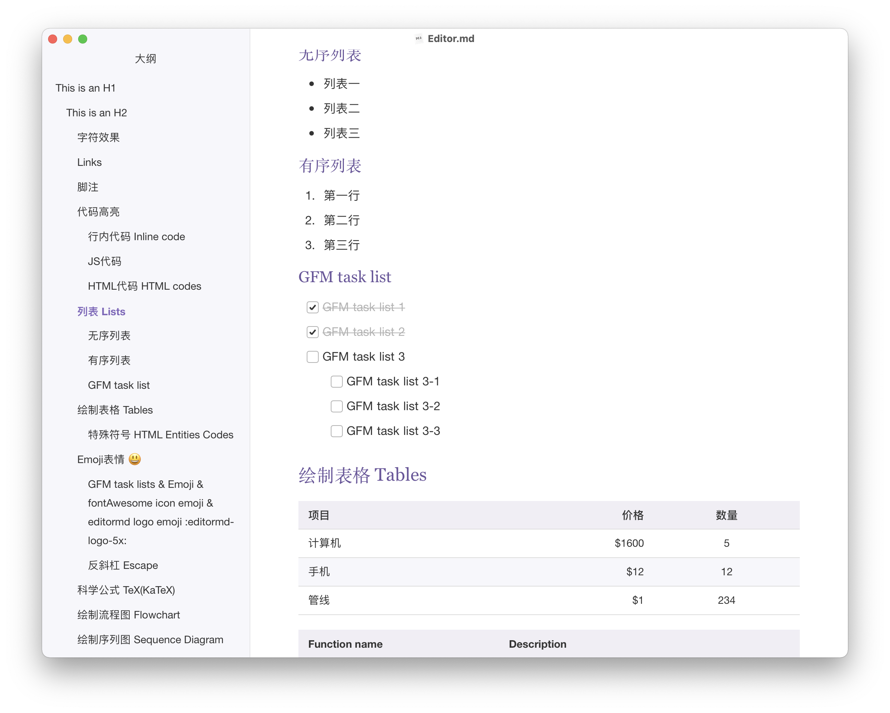

## 主题介绍

[purple.css](purple.css) 是紫色调：

[purple-plain.css](purple-plain.css) 是 ~~黑长直~~ 黑色调

## 关于字体

1. 标题使用衬线(Serif)字体，比如：Noto Serif
2. 正文使用非衬线(Sans)字体，比如：Mac/Ubuntu/Windows 系统字体，[Helvetica Neue](https://freefontsdownload.net/free-helveticaneue-font-74318.htm)等
3. 代码使用等宽字体，比如：[JetBrains Mono](https://www.jetbrains.com/lp/mono/)

## 更多效果：

