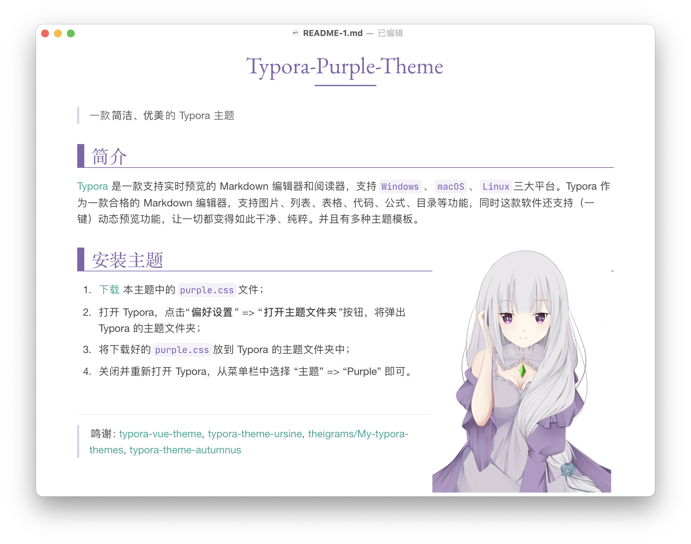
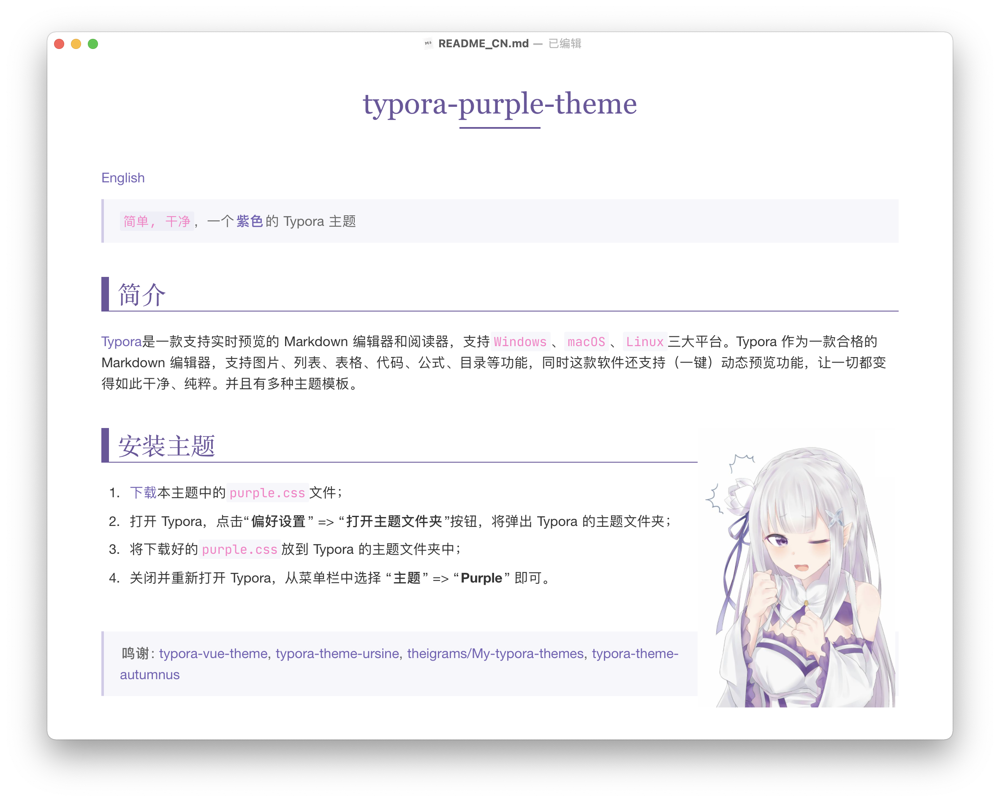
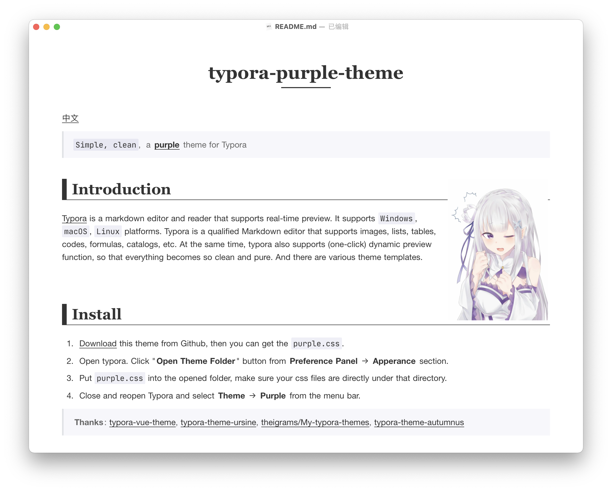
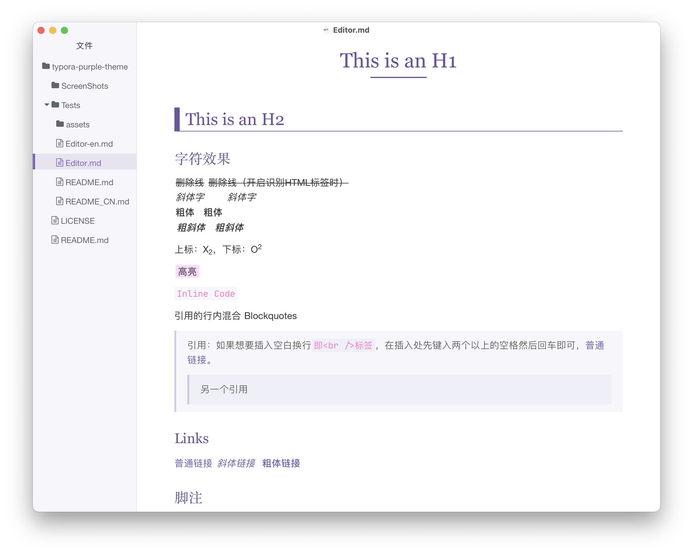
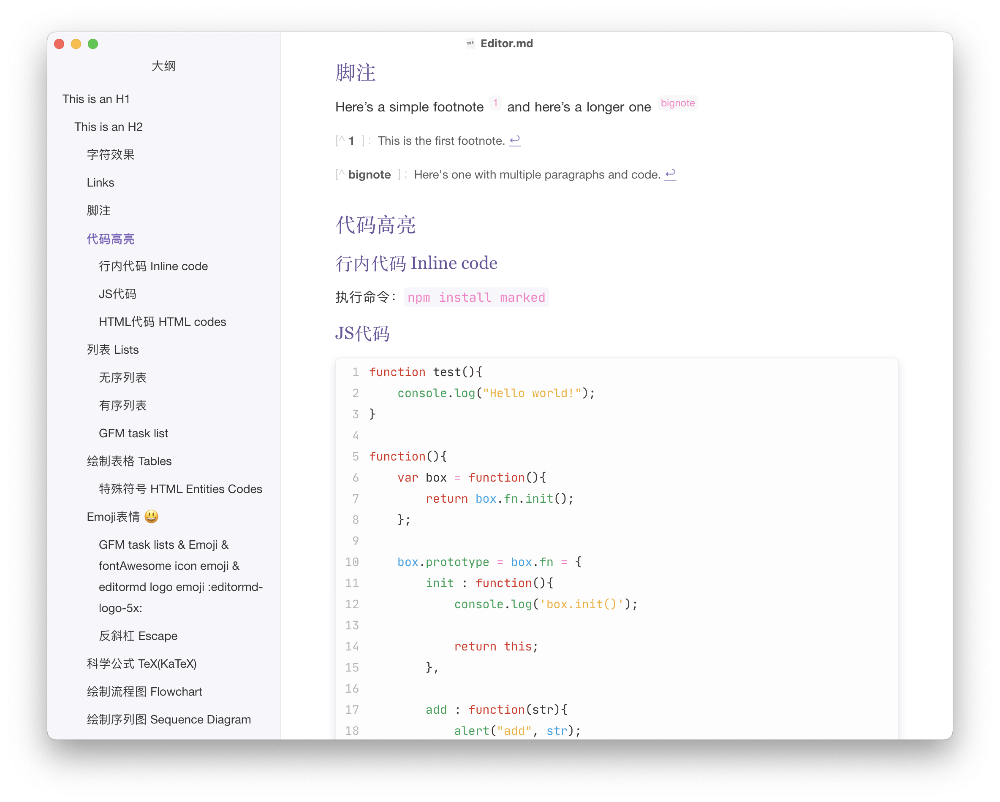

[English](./README-en.md)

## 主题介绍

`purple.css` 和 `purple-classic.css` 是2 种紫色调：

`purple-plain.css` 是 ~~黑长直~~ 简约黑色调

`purple-blue.css` 是 ~~女仆~~ 简约蓝色调

`purple-green.css` 是 ~~大葱~~ 简约绿色调

## 关于自定义

可以很容易自定义喜欢的色调，只需要 copy 任一 `purpe-xxx.css`，在其中修改或添加配置即可